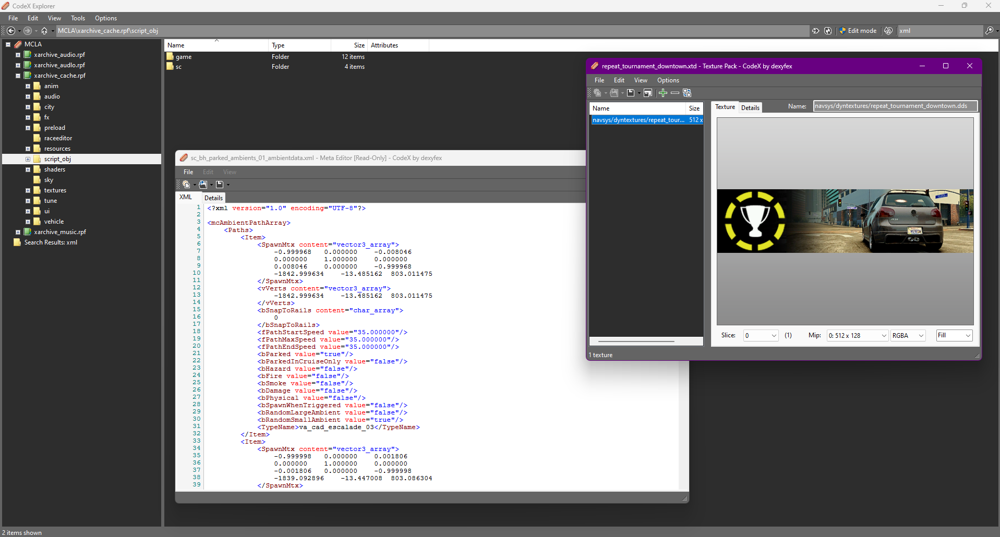
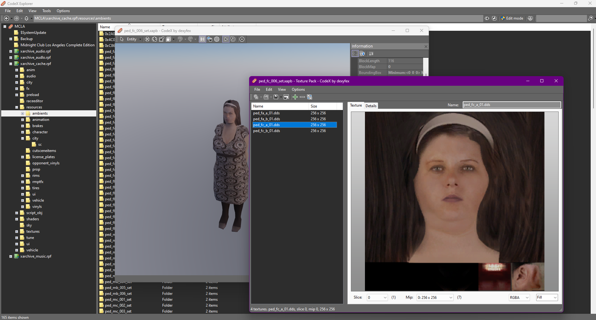
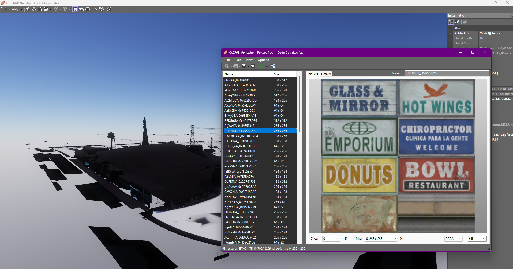

# CodeX (026)

CodeX implementation for Midnight Club: Los Angeles on Xbox 360.

--------------------

You need the main CodeX engine to either run this or compile the source.     
More info here : [@dexyfex](https://www.patreon.com/dexyfex) and [CodeWalker discord](https://discord.gg/rgU4SbeR)   

--------------------             

After that, [download the files](https://github.com/Foxxyyy/CodeX.Games.RDR1/releases/latest) and paste them to the CodeX/Explorer folders, next to the executable.  

# CodeX Contributors
* dexyfex     
* nta      
* Disquse       
* alexguirre      
* CP      
* skylumz      
* colton      
* Ktoś      
* Mars (Im Foxxyyy)      
* Neos
* Western

# Credits for this project
* Mars (Im Foxxyyy) 
* Noxis    
* Sockstress                    
* LennyH (BadassBaboon)                                     
* CabooseSayzWTF             

# Random Pictures

